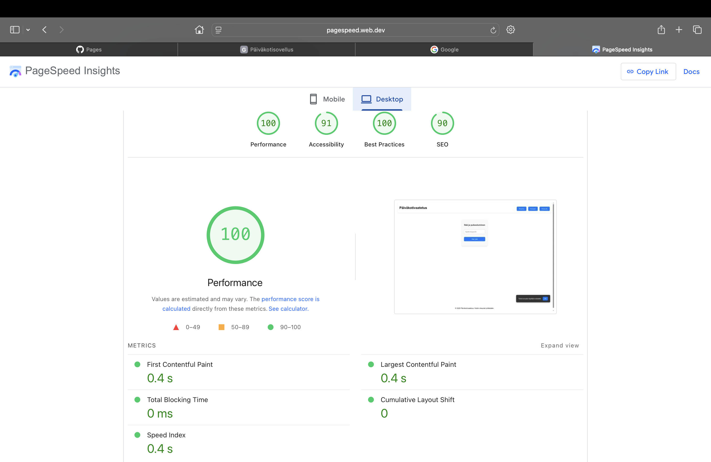
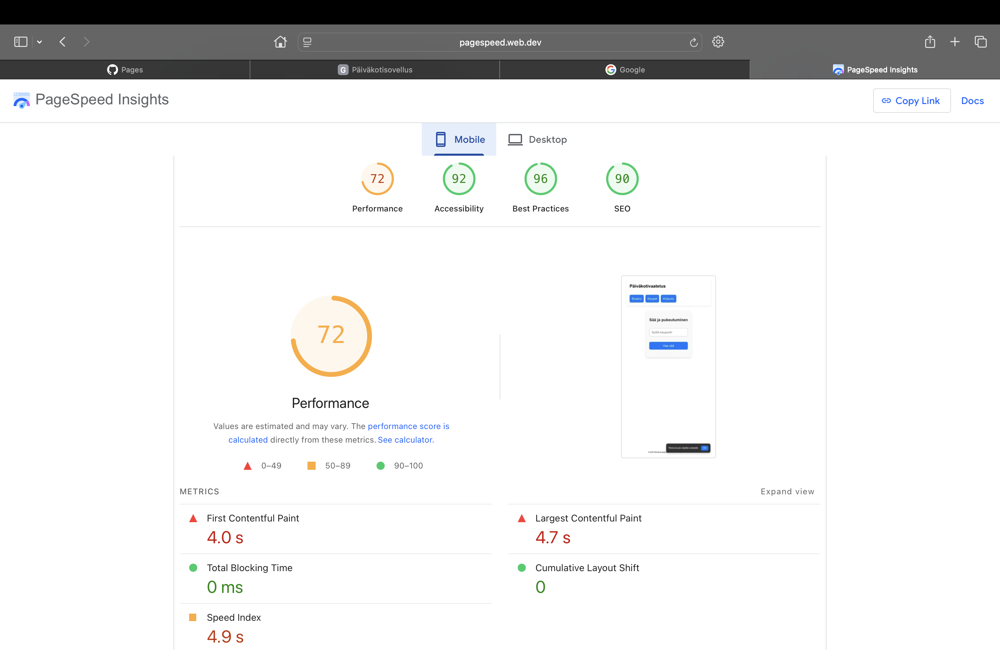

# Harjoitustyö – Pukeutumisvinkki päiväkotiin

Tämä sovellus tarjoaa pukeutumisvinkkejä päiväkoti-ikäisille lapsille perustuen paikkakunnan sääennusteeseen. Tavoitteena on helpottaa vanhempien arkea ja varmistaa, että lapsi on pukeutunut sään mukaisesti. Sovelluksessa on käytössä OpenWeatherMapin säätieto, Firebase-kirjautuminen, Firestore-vinkkilista sekä yksinkertainen ja kevyt käyttöliittymä CSS:llä.

- **OpenWeatherMap API** (sääennusteet)
- **React + TypeScript**
- **Firebase Auth** (kirjautuminen)
- **Firestore** (vinkit lastenvaateliikkeistä)
- **CSS** (responiivinen ulkoasu)
- **LocalStorage** (käyttäjän tallennukset)
- **GitHub Pages** (julkaisu)

## Responsiivisuus eri laitteilla

### Pöytäkoneet

Sovellus skaalautuu hyvin suurelle näytölle. Navigointi, sisältö ja säätiedot ovat selkeästi esillä, ja ulkoasu pysyy ryhdikkäänä kaikilla resoluutioilla.

### Mobiililaitteet

Pienillä näytöillä käyttöliittymä mukautuu hyvin. Elementit järjestyvät pystysuunnassa loogisesti ja sovelluksen käyttö on sujuvaa myös yhdellä kädellä.

### Tablettilaitteet

Tableteilla sovellus toimii hyvin sekä vaaka- että pystyasennossa. Käyttökokemus säilyy miellyttävänä riippumatta näytön suunnasta.

---

## Selainyhteensopivuus

Sovellus on testattu seuraavilla selaimilla:

- **Google Chrome** – kaikki toimii normaalisti ja nopeasti  
- **Safari** – pienet tyylilliset erot, mutta käytettävyys kunnossa  
- **Microsoft Edge** – nopea ja sujuva käyttökokemus

## Suorituskyky ja latausajat

**Mobiili**  
- Sisältö näkyy noin 1 sekunnissa  
- Sivun lataus on kevyt ja nopeasti reagoiva  
- Elementit latautuvat ilman häiriöitä

**Tietokone**  
- Näkyvä sisältö ilmestyy lähes välittömästi  
- Ei havaittua viivettä tai rakenteen siirtymistä  
- Sovellus reagoi nopeasti käyttäjän toimintaan

## PageSpeed Insights -tulokset

### Desktop

- **Performance**: 100  
- **Accessibility**: 91  
- **Best Practices**: 100  
- **SEO**: 90  

### Mobile

- **Performance**: 72  
- **Accessibility**: 92  
- **Best Practices**: 96  
- **SEO**: 90  

## Yhteenveto

Sovellus on selkeä ja käytännöllinen arjen apuväline vanhemmille. Se toimii luotettavasti eri laitteilla, latautuu nopeasti ja on helposti lähestyttävä. Toteutus on teknisesti toimiva ja hyödyntää moderneja web-teknologioita onnistuneesti. Kokonaisuus on kevyt mutta hyödyllinen.

## Katso julkaistu versio

<iframe src="/kliikanen/lopputyo/index.html" width="100%" height="600px" style="border:none; border-radius:8px"></iframe> 

[→ Avaa sovellus selaimessa](https://kimmoliikanen.github.io/kliikanen/lopputyo/index.html)

